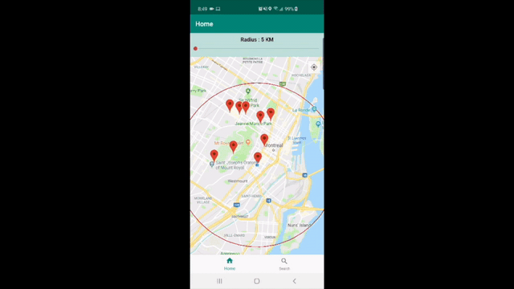

# Twitter API Coding Test

Welcome to **Bell's Twitter API coding Test** codebase.

# DEMO

# Required Task tackle under this code base

## A) a data visualizer for Twitter, based on the location of the most recent tweets that have geolocation information. In particular, you will use the Twitter framework to get the most recent tweets within a 5 km (distance can be customizable) radius of the user’s current location and display it on a map.If the user taps on one of the pins, a small view should display some information about the tweet, and a button to take them to a separate view that displays more information about the tweet (user’s twitter handle, the tweet’s text, timestamp, user’s avatar, etc.). On this separate view, the user should have the option of favoriting or retweeting that particular tweet (this can also be accomplished using the Twitter Framework).

## B) The application should be able to display tweets search results based on keywords and hashtags. The listed tweets containing images and videos should be viewable and playable respectively.

## Bonus: While on the map, the app can continuously poll for new tweets, and display them on the map when they are received.  

# Twitter API SDK reference (https://github.com/twitter-archive/twitter-kit-android)
# Twitter Developer Account if you want to create your own test consumer API key and secret under your own account ( https://developer.twitter.com/en/account/get-started )

And now, ***Dabbing Android***! 

# Kotlin

We're using Kotlin in our codebase. Take a look at [Kotlin Coding Conventions](https://kotlinlang.org/docs/reference/coding-conventions.html)

